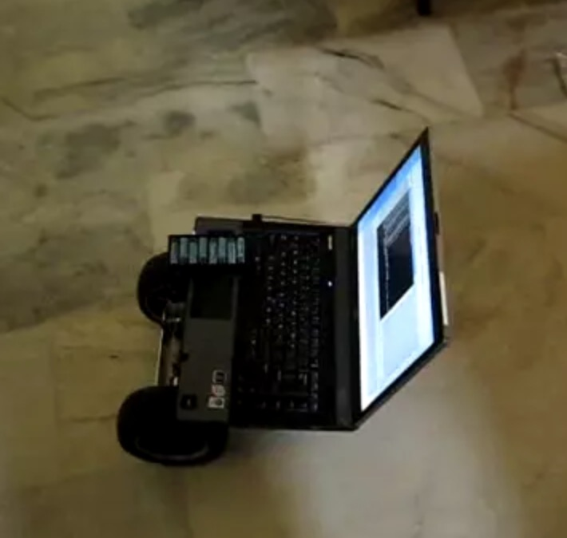

Ajay Harikumar
===========

**I work at Intel as a Principal Engineer in the Artificial Intelligence Product Group team**    
I work in the field of Distributed Deep Learning and have 20+ years of software experience and 10 patents   

   
Resume
------
[Resume](resume.md)   
   
[PDF version of Resume](https://github.com/ajayhk/ajayhk.github.io/raw/master/pdf/resume_no_addr.pdf)

   
   
   
Side-projects
--------
   
*   Reddit Comments Bot (2017)     
    Created a Bot that was trained using [RNN](https://github.com/martin-gorner/tensorflow-rnn-shakespeare) on [Reddit Comments corpus](https://archive.org/details/2015_reddit_comments_corpus) to respond automatically to subreddit comments   
    The Bot learnt the subreddit's language and comments style to mimic and create new comments that resembled the subreddit style and culture creating the illusion of a real person
       
    
    
*   [Quant algos](https://github.com/ajayhk/quant/tree/master/algos) on [Quantopian](https://www.quantopian.com/) (2015)   
    Python based quant strategies for trading stocks and maximizing returns. Based on Quantopian trading APIs
       
    
    
*   [Reddit Picture Downloader](https://github.com/ajayhk/reddit-downloader) (2014)   
    Python script to automatically download pictures from sub-reddits like pics or aww including links from Imgur, gfycat, etc.    
    
    

*   Self Driving Robot (2009)   
    Project was inspired by DARPA self driving project and used a kit developed by [RoBeDo](https://www.slashgear.com/robedo-netbook-powered-autonomous-robots-0936912/)  
    It used sensors from [Phidgets](https://www.phidgets.com/) and I used OpenCV and IR sensors to detect and avoid obstacles      
   
    
    
    
    
    <picture>
      <source type="image/webp" srcset="https://raw.githubusercontent.com/ajayhk/ajayhk.github.io/master/images/robot.webp">
      
    </picture>
    
   
    

Others:   
------

MS Dissertation: [EFI based lightweight Virtual Machine Manager (VMM)](https://github.com/ajayhk/ajayhk.github.io/raw/master/pdf/EFI_VMM_MS_dissertation.pdf)

   
   
   
   
   

Contact me:   
------- 
Email: ajay dot harikumar at gmail dot com    

[LinkedIn](https://www.linkedin.com/in/ajayharikumar/)   

